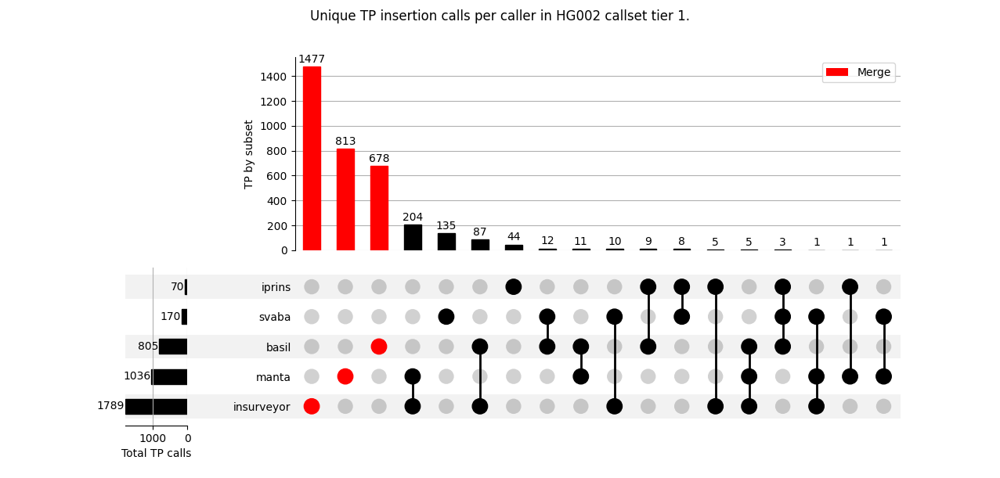

INSinPAL User Guide
===================

## Table of content

[//]: #

* [Introduction](#Introduction)
* [Palindromic fragile sites](#Palindromic-fragile-sites)
  * [Palindrome mining algorithm](#Palindrome-mining-algorithm)
  * [Filtering step](#Filtering-step)
* [SV callers](#SV-callers)
  * [Benchmarking](#Benchmarking)
  * [INSurVeyor](#INSurVeyor)
  * [Manta](#Manta)
  * [Basil](#Basil)
* [Annotations](#Annotations)
  * [MEIs annotation](#MEIs-annotation)
  * [Source of inserted sequence](#Source-of-inserted-sequence)
  * [Length of inserted sequence](#Length-of-inserted-sequence)
  * [Functionnal annotations](#Functionnal-annotations)
* [Installation](#Installation)  
* [Execution](#Execution)

[//]: #


## Introduction

When working with Whole Genome Sequencing (WGS) data for diagnosis purposes, it is essential to implement filtering steps to retrain only relevant mutations/calls made by variant callers. Otherwise, thousands of them would need to be filtered by experts. INSinPAL is a Snakemake workflow for analyzing, filtering and formatting large insertion calls in mapped paired-reads data (BAM). INSinPAL utilizes two structural variant (SV) callers ([Manta](https://github.com/Illumina/manta) and [Basil](https://github.com/seqan/anise_basil)) and one insertion-specialized caller ([INSurVeyor](https://github.com/kensung-lab/INSurVeyor)) to form a metacaller for germline large insertion variant detection. The main idea behind INSinPAL is to focus variant selection on palindromic fragile sites, as they are prone to forming DNA secondary strucures and undergoing chromosomal rearrangment. Two modules enable the detection of source and length of the inserted sequence at a given breakpoint, providing more infnromation for variant analysis by experts.


## Palindromic fragile sites

In a genomic context, a palindrome consists of two inverted repeated DNA sequences, where the reverse complement of one sequence matches the sequence of the other. These regions are prone to forming DNA secondary structures through intrastrand base pairing. The resulting structures, such as hairpins on single-strand DNA or cruciforms on double-strand DNA, create hotspots for chromosomal rearrangements. This occurs because they can lead to double-strand breaks (DSBs) through replication fork stalling ([*Mikleni and al.*](https://www.mdpi.com/1422-0067/22/6/2840)). If DSBs are not repaired or are misrepaired, it can lead to deletions. translocations, inversions and large insertions. These alterations can distrupt the genetic functions of nearby genes, potentially leading to various genetic disorders and rare diseases ([*J. Bissler*](https://www.imrpress.com/journal/FBL/3/4/10.2741/A284)).

Thus, understanding the mechanisms leading to palindrome instability and the stability of their secondary structures is crucial for detecting palindromic fragile sites. Indeed, many palindromes do not threaten genome stability. Instead, they contribute to the dynamics of gene regulation. In the literature, three essential characteristics of palindromes are commonly related to their instability (forming secondary strucutures): the length of one repeat, or a stem, the presence and length of a spacer (sequence between both stems) and the sequance mismatching between both stems. The longer the stem, the shorter the spacer, and the higher the identity between stems, the more likely a palindrome is th be unstable and form a secondary structure. These three features also similarly contribute to the stability of the secondary structure ([*Wang and al.*]((https://www.sciencedirect.com/science/article/pii/S0014579306000986))).


### Palindrome mining algorithm

The first step of the process is to find all palindromic sites in a reference genome. This is done by the rules in `mine_palindromes_in_genome.smk` and the main algorithm is in ths script `palindrome_mining_by_chr.py`. Basically the algorithm follows these steps:

```
Reference sequence in string: ref
minimum stem length: min_stem
maximum spacer length: max_spacer
FOR each central_position_of_a_potential_palindrome in all_positions_in_ref:
  IF central_position_nucleotide IS NOT sequenced:
    THEN skip
  ENDIF

  start of seed palindorme sequence in ref: start = midpoint - min_stem
  idem end: end = mindpoint + min_stem
  EXTRACT putative_minimum_palindrome FROM ref VIA start, end

  IF putative_minimum_palindrome is palindromic:
    CALL longest_palidromic_sequence BY extanding putative_minimum_palindrome edges
    ADD putative_minimum_palindrome_with_spacer

  ELSE:
    FOR each putative_spacer_length in max_spacer:
      IF putative_minimum_palindrome_with_spacer is palindromic:
        CALL longest_palidromic_sequence BY extanding putative_minimum_palindrome_with_spacer edges
        ADD putative_minimum_palindrome_with_spacer
  ENDIF
```

Note that, based on the literature, a pre-filtering of extracted palindromes si done. The main criteria are:

* A minimum length for the seed palindrome fixed to 8 nucleotides.
* An identity of at leaste 85% between both stems.
* A maximum spacer length fixed to 20 nucleotides.

These values can be modified by user but they have a biological relevance ([*Wang and al.*]((https://www.sciencedirect.com/science/article/pii/S0014579306000986))).

The output BED file contians the following fields:

* Chromosome name.
* Start in reference genome (0 based).
* Stop in reference genome.
* Palindrome type: Perfect or Near (less than 100% identity or Spacer).
* Palindrome length with spacer.
* Spacer sequence length.
* Mismatch rate in %.
* AT percentage in palindrome.


### Filtering step

From the paper [*long inverted repeats in eukaryotic genomes: Recombinogenic motifs determine genomic plasticity*](https://www.sciencedirect.com/science/article/pii/S0014579306000986), the following formule was used to select putative unstable palindromes based on their structural characteristics:

```math
stem\_length/spacer\_length >= mismatch\_ratio
```

A higher stem length relative to the spacer length suggests a disposition to intrastrand base pairing initially and a stable secondary structure subsequently, especially if the mismatch ratio is low.

New fields are added to the BED file and will consitute the main databases to queary for palindromic fragiles sites:

* Palindrome type: Perfect, Near and Spacer (if there is a spacer sequence).
* Recombinogenicity score which corresponds to ```stem\_length/spacer\_length```.
* Size groups to query by size group the database: 0-50 bp/51-99 bp/100-200 bp/>200 bp.

INSinPAL, as default settings, uses palindromic fragile sites within ```100-200 bp and >200 bp``` as longer palindromes are more prone to form secondary structures.


## SV callers

Short-read SV calling software was selected from relevant [benchmarking papers](https://link.springer.com/article/10.1186/s13059-019-1720-5) and has been benchmarked to select the most sensitive tools for detecting large insertions in WGS data. The Tier 1 benchmark regions of the GIAB [HG002 SV callset](https://ftp-trace.ncbi.nlm.nih.gov/ReferenceSamples/giab/data/AshkenazimTrio/analysis/NIST_SVs_Integration_v0.6/) was used for this evaluation. Moreover, newely released callers have been also taken in account.


### Benchmarking

Since not all software supports sequence and haplotype-resolved calls, the calls were compared to the callset based on their breakpoint locations, allowing for a ten-base pair distance between them. Calls outside this range were considered false positives. Additional annotations were made to count MEIs count in calls.

**Table 1: Callers time and memory performance with 12 cores on HG002 BAM.**

| Caller           | CPUs time     | Max memory | Max swap | Real time    |
| :---:            | :---:         | :---:      | :---:    | :---:        |
| INSurVeyor 1.1.2 | 25098.02 sec  | 19227 MB   | 25334 MB | 2091.5 sec   |  
| Manta 1.6.0      | 19273.33 sec  | 1370 MB    | 3174 MB  | 1606.11 sec  |
| Basil 1.2        | 21859.80 sec  | 5133 MB    | 60291 MB | 1821.65 sec  |
| iPRIns 1.1.0     | 6530.30 sec   | 675 MB     | 6246 MB  | 544.19 sec   |
| SvABA 1.2.0      | 150486.97 sec | 7638 MB    | 8196 MB  | 12540.58 sec |

**Table 2: Callers benchmark results on HG002 Tier 1 callset.**

| Soft       | Precision | Recall         | TP           | FP       | FN          | MEIs in TP |
| :---:      | :---:     | :---:          | :---:        | :---:    | :---:       | :---:      |
| INSurVeyor | 0.63/0.68 | 0.33/0.30/0.91 | 1790/1657/20 | 1056/795 | 3654/3785/2 | 593        |
| Manta      | 0.82/0.67 | 0.19/0.18/0.91 | 1036/995/20  | 233/488  | 4408/4447/2 | 135        | 
| Basil      | 0.24/NA   | 0.15/NA/0.36   | 805/NA/8     | 2499/NA  | 4639/NA/14  | 161        | 
| iPRIns     | 0.01/NA   | 0.01/NA        | 70/NA        | 8088/NA  | 5374/NA     | 3          | 
| svABA      | 0.04/NA   | 0.03/NA/0.18   | 178/NA/4     | 4331/NA  | 5266/NA/18  | 17         |

In Table 2, the first number separated by a slash (/) represents the benchmark metric value from a custom benchmarking script. The second value corresponds to the [truvari](https://github.com/ACEnglish/truvari) `bench` tool, and the third number corresponds to the benchmark metric for 22 simulated large insertions. As expected, short-read sequencing data is not efficient to detect large insertions as often this kind of events occurs in tendem repeats or segmental duplications which are complex region to align with this kind of data. INSurVeyor and Manta have the best performance in simulated data, two insertions are missed because they were not well intergrated in the BAM file. 

To see the unique calls made by each caller, an upset plot has beed plotted:




### INSurVeyor

### Manta

### Basil

## Annotations

### MEIs annotation

### Source of inserted sequence

### Length of inserted sequence

### Functionnal annotations


## Installation


## Execution
